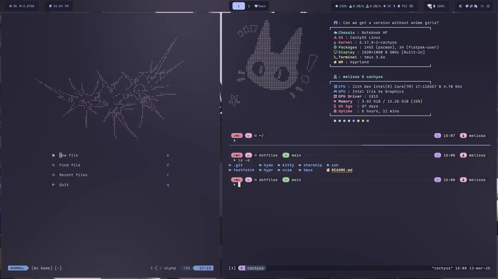

# Welcome to my dotfiles!

```
⠀⠀⠀⠀⠀⠀⠀⢀⣤⣾⠿⠿⣦⡀⠀⠀⠀⠀⠀⢀⣠⣴⠿⢷⣤⡀⠀⠀⠀⠀⠀
⠀⠀⠀⠀⠀⠀⣠⣾⠋⠁⠀⠀⠙⢿⣦⣤⣤⣤⣴⡿⠋⠁⠀⠀⠙⣿⡄⠀⠀⠀⠀
⠀⠀⠀⠀⠀⠐⠟⠁⠀⠀⠀⠀⠀⠈⠉⠁⠈⢩⠁⠀⠀⠀⠀⠀⠀⠻⠧⠀⣀⣀⣀
⠀⠀⠀⠿⣶⣶⠀⠀⠀⠀⠀⠀⠀⠀⠀⠀⠀⠀⠀⠀⠀⠀⠀⠀⠀⠀⠐⠿⠟⠛⠛
⠀⠀⣤⣤⣄⡀⠀⠀⠀⠀⠀⠀⠀⠀⠀⠀⠀⠀⠀⠀⠀⠀⠀⠀⠀⠀⠀⠰⠶⠿⠛
⠀⣀⣀⡉⠙⠃⠀⣤⣦⠀⠀⣠⣤⣤⣤⣤⣤⣤⣤⣤⣄⠀⢰⣦⠀⠀⠀⡀⠀⠀⠀
⣼⠟⠛⢿⣇⠀⠀⠀⠀⠀⠀⣿⣇⠀⠀⠀⠀⠀⠀⠀⠀⣿⠃⠀⠀⠀⠀⢰⣿⠀⠀
⣿⠀⠀⠘⠛⠛⠛⢷⣦⠀⠀⠀⢿⡆⠀⠀⠀⠀⠀⢠⡟⠀⠀⢀⣠⣴⠟⠁⠀⠀⠀
⣿⠀⠀⠀⠀⠀⠀⠀⢻⣿⠦⠤⠄⣿⡄⠀⠀⠀⢰⣿⠃⠻⠿⠻⢿⣧⠀⠀⠀⠀⠀
⣿⠀⠀⠀⠀⠀⢀⣀⣸⣿⠀⠀⠀⠸⣿⣄⠀⢠⣾⠏⠀⠀⣤⣤⡾⠟⠀⠀⠀⠀⠀
⣿⣄⠀⠀⠀⠀⠀⢀⣾⣿⠀⠀⠀⠀⠀⠿⣶⣾⠟⠀⠀⠀⢸⡇⠀⠀⠀⠀⠀⠀⠀
⠘⠿⣿⣶⣶⣶⡿⠿⠛⣿⠀⠀⣤⣤⣤⣤⣶⣶⣾⠿⣷⠀⣼⡇⠀⠀⠀⠀⠀⠀⠀
⠀⠀⠀⠀⠀⠀⠀⠀⠀⠹⣷⣤⣿⠋⠁⠀⠀⠀⠀⠀⠻⠷⠟⠃⠀⠀⠀⠀⠀⠀⠀
⠀⠀⠀⠀⠀⠀⠀⠀⠀⠀⠈⠉⠁⠀⠀⠀⠀⠀⠀⠀⠀⠀⠀⠀⠀⠀⠀⠀⠀⠀⠀
```
This is a personal modification of [HyDE hyprland dotfiles](https://github.com/HyDE-Project/HyDE), and it's intended to be applied on top of that base.
Here I include a new theme, configurations for fastfetch, kitty, nvim, starship, tmux and zsh, also changes to the window rules and keybinds.

> 👀 You can copy nvim, starship, and tmux configurations without HyDE tho.

## Required
- [HyDE](https://github.com/HyDE-Project/HyDE) setup!!! 
- [nvim](https://neovim.io/)
- [tmux](https://github.com/tmux/tmux/wiki) and [TPM](https://github.com/tmux-plugins/tpm)
- [eza](https://github.com/eza-community/eza)

## Install
Just clone this repo

```bash
git clone https://github.com/melisapo/dotfiles.git
```

And most of it is just copying to `~/.config` and overwriting if it already exists (always make a backup first T.T)

### Hyde
You will need to copy the `hyde/themes/Soki/` theme, along with the other themes, to `~/.config/hyde/themes/`.

### Hypr
Just copy the `keybindings.conf` and `windowrules.conf` in `~/.config/hypr/` and overwrite.

### Nvim
- Copy the `nvim/` folder to `~/.config/ `
- Open nvim, it will install the plugins
- Then type `:Lazy sync`

### Tmux
- Make sure you have TPM installed:
```bash
git clone https://github.com/tmux-plugins/tpm ~/.tmux/plugins/tpm
```
- Create a `~/.tmux.conf` file and past the content in `tmux/tmux.conf` there
- Start tmux and install the plugins:

Press: 
```bash
Ctrl + a
``` 
Then:
```bash
Shift + I
```
- Reload config:
```bash
tmux source-file ~/.tmux.conf
```

**Everything else is just copying into its respective directory inside `~/.config`**

## Silly Screenshot 



## 
```
⠀⠀⠀⠀⠀⠀⠀⠀⠀⠀⠀⠀⠀⠀⠀⠀⠀⠀⠀⠀⠀⢀⡀⠀⠀⠀⠀
⠀⠀⠀⠀⢀⡴⣆⠀⠀⠀⠀⠀⣠⡀⠀⠀⠀⠀⠀⠀⣼⣿⡗⠀⠀⠀⠀
⠀⠀⠀⣠⠟⠀⠘⠷⠶⠶⠶⠾⠉⢳⡄⠀⠀⠀⠀⠀⣧⣿⠀⠀⠀⠀⠀
⠀⠀⣰⠃⠀⠀⠀⠀⠀⠀⠀⠀⠀⠀⢻⣤⣤⣤⣤⣤⣿⢿⣄⠀⠀⠀⠀
⠀⠀⡇⠀⠀⠀⠀⠀⠀⠀⠀⠀⠀⠀⠀⣧⠀⠀⠀⠀⠀⠀⠙⣷⡴⠶⣦
⠀⠀⢱⡀⠀⠉⠉⠀⠀⠀⠀⠛⠃⠀⢠⡟⠀⠀⠀⢀⣀⣠⣤⠿⠞⠛⠋
⣠⠾⠋⠙⣶⣤⣤⣤⣤⣤⣀⣠⣤⣾⣿⠴⠶⠚⠋⠉⠁⠀⠀⠀⠀⠀⠀
⠛⠒⠛⠉⠉⠀⠀⠀⣴⠟⢃⡴⠛⠋⠀⠀⠀⠀⠀⠀⠀⠀⠀⠀⠀⠀⠀
⠀⠀⠀⠀⠀⠀⠀⠀⠛⠛⠋⠁⠀⠀⠀Enjoy!⠀⠀⠀⠀⠀⠀⠀⠀⠀⠀⠀⠀
```


